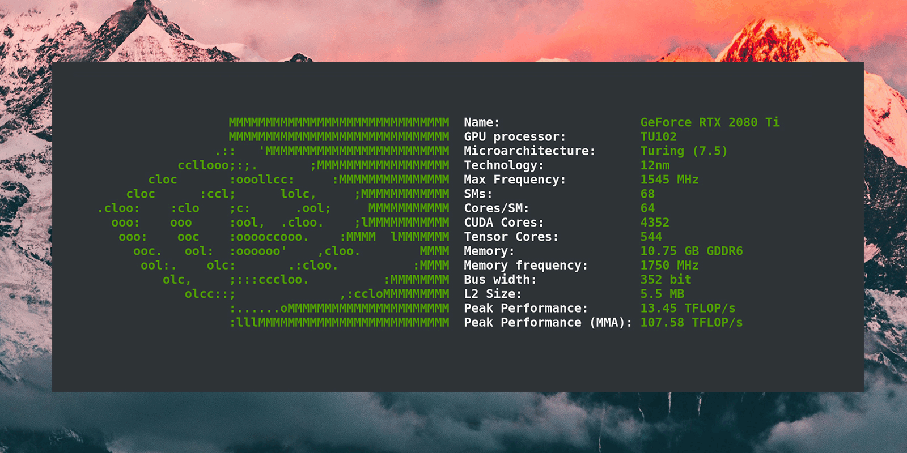

<p align="center"></p>

<h4 align="center">Simple yet fancy GPU architecture fetching tool</h4>

<p align="center"> </p>

<div align="center">
  
  <a href="https://github.com/Dr-Noob/gpufetch/stargazers">
    
  </a>
  <a href="https://github.com/Dr-Noob/gpufetch/issues">
    
  </a>
  <a href="https://github.com/Dr-Noob/gpufetch/blob/master/LICENSE">
    
  </a>
</div>

<p align="center"> </p>

<p align="center">
gpufetch is a command-line tool written in C++ that displays the GPU information in a clean and beautiful way
</p>

<p align="center">

</p>

# Table of contents
<!-- UPDATE with: doctoc --notitle README.md -->
<!-- START doctoc generated TOC please keep comment here to allow auto update -->
<!-- DON'T EDIT THIS SECTION, INSTEAD RE-RUN doctoc TO UPDATE -->


- [1. Support](#1-support)
- [2. Backends](#2-backends)
  - [2.1 CUDA backend is not enabled. Why?](#21-cuda-backend-is-not-enabled-why)
  - [2.2 The backend is enabled, but gpufetch is unable to detect my GPU](#22-the-backend-is-enabled-but-gpufetch-is-unable-to-detect-my-gpu)
- [3. Installation (building from source)](#3-installation-building-from-source)
- [4. Colors](#4-colors)
  - [4.1 Specifying a name](#41-specifying-a-name)
  - [4.2 Specifying the colors in RGB format](#42-specifying-the-colors-in-rgb-format)
- [5. Bugs or improvements](#5-bugs-or-improvements)

<!-- END doctoc generated TOC please keep comment here to allow auto update -->

## 1. Support
gpufetch supports the following GPUs:

- **NVIDIA** GPUs (Compute Capability >= 2.0)
- **Intel** iGPUs (Generation >= Gen6)

Only compilation under **Linux** is supported.

## 2. Backends
gpufetch is made up of two backends:

- CUDA backend
- Intel backend

Backends are enabled and disabled at **compile time**. When compiling gpufetch, check the CMake output to see which backends are enabled.

**gpufetch will only detect your GPU if the appropiate backend was enabled during compilation (e.g., will not detect your NVIDIA GPU if CUDA backend is disabled!)**

By default, CMake will try to enable all backends. However, backends can be manually disabled. See the `build.sh` script for instructions.

### 2.1 CUDA backend is not enabled. Why?
CUDA is mandatory to build gpufetch with CUDA backend enabled. However, when building gpufetch, cmake may be unable to find the CUDA installation. If CUDA is installed but CMake does not find it, you need to pass the CUDA path to cmake. You can do this easily by editing directly the `build.sh` script. For example:

```
cmake -DCMAKE_CUDA_COMPILER=/usr/local/cuda/bin/nvcc -DCMAKE_CUDA_COMPILER_TOOLKIT_ROOT=/usr/local/cuda/ ..
```

### 2.2 The backend is enabled, but gpufetch is unable to detect my GPU
First, make sure that your GPU is enabled. You can print enabled GPUs with `lspci`:

```
[drnoob@noob ~]$ lspci -nn | grep VGA
```

If there is a NVIDIA GPU or Intel iGPU in the system and the appropiate backend is enabled but gpufetch does not detect the GPU, please create a new issue with the provided error message (in the gpufetch output) on the [issues page](https://github.com/Dr-Noob/gpufetch/issues).

## 3. Installation (building from source)
You will need (mandatory):

- C++ compiler (e.g, `g++`)
- `zlib`
- `cmake`
- `make`

and optionally:

- CUDA (needed for CUDA backend)
- pciutils (a local copy will be downloaded if pciutils is not installed)

To build gpufetch, just clone the repo and run `./build.sh`:

```
git clone https://github.com/Dr-Noob/gpufetch
cd gpufetch
./build.sh
./gpufetch
```

## 4. Colors
By default, `gpufetch` will print the GPU logo with the system color scheme. However, you can set a custom color scheme in two different ways:

### 4.1 Specifying a name

 By specifying a name, gpufetch will use the specific colors of each manufacture. Valid values are:

- intel
- nvidia

```
./gpufetch --color intel (default color for Intel)
```

### 4.2 Specifying the colors in RGB format

5 colors must be given in RGB with the format: ``[R,G,B:R,G,B:R,G,B:R,G,B:R,G,B]``. These colors correspond to the GPU logo color (first 3 colors) and for the text colors (following 2).

```
./gpufetch --color 239,90,45:210,200,200:0,0,0:100,200,45:0,200,200
```

## 5. Bugs or improvements
See [gpufetch contributing guidelines](https://github.com/Dr-Noob/gpufetch/blob/master/CONTRIBUTING.md)
