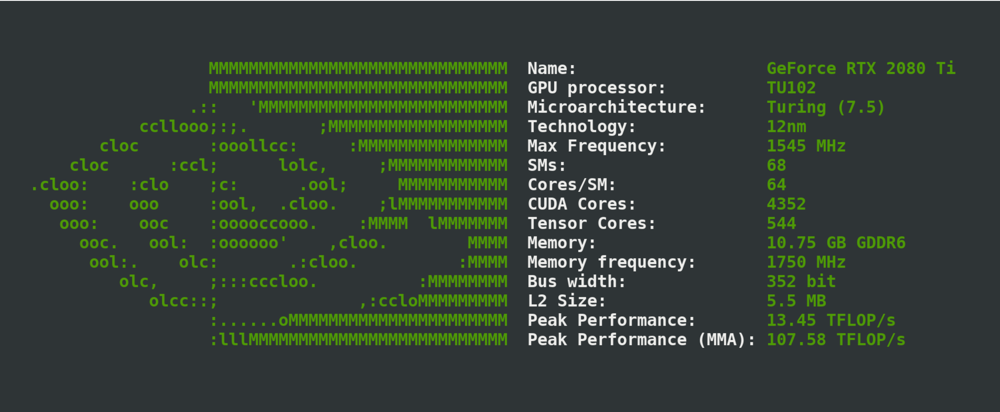

<p align="center"></p>

<h4 align="center">Simple yet fancy GPU architecture fetching tool</h4>
&nbsp;

<div align="center">


[](https://github.com/Dr-Noob/gpufetch/stargazers)
[](https://github.com/Dr-Noob/gpufetch/issues)
[](https://github.com/Dr-Noob/gpufetch/blob/master/LICENSE)

gpufetch is a command-line tool written in C that displays the GPU information in a clean and beautiful way

</div>

<p align="center"></p>

# Table of contents
<!-- UPDATE with: doctoc --notitle README.md -->
<!-- START doctoc generated TOC please keep comment here to allow auto update -->
<!-- DON'T EDIT THIS SECTION, INSTEAD RE-RUN doctoc TO UPDATE -->


- [1. Support](#1-support)
- [2. Installation (building from source)](#2-installation-building-from-source)
- [3. Colors and style](#3-colors-and-style)
- [4. Bugs or improvements](#4-bugs-or-improvements)

<!-- END doctoc generated TOC please keep comment here to allow auto update -->

# 1. Support
gpufetch supports NVIDIA GPUs under Linux only.

# 2. Installation (building from source)
You will need:

- C++ compiler (e.g, `g++`)
- `cmake`
- `make`
- CUDA (NVIDIA backend)
- pciutils (optional)

To build gpufetch, just clone the repo and run `./build.sh`:

```
git clone https://github.com/Dr-Noob/gpufetch
cd gpufetch
./build.sh
./gpufetch
```

- NOTE 1: It is recomended to install the `pciutils` development package, which is needed by gpufetch. If it is not installed, it will be downloaded and built automatically just to compile gpufetch.
- NOTE 2: When building gpufetch, cmake may fail if it is unable to find the CUDA installation. If CUDA is installed but CMake does not find it, you need to pass the CUDA path to cmake. You can do this easily by editing directly the `build.sh` script. For example:

```
cmake -DCMAKE_CUDA_COMPILER=/usr/local/cuda/bin/nvcc -DCMAKE_CUDA_COMPILER_TOOLKIT_ROOT=/usr/local/cuda/ ..
```

# 3. Colors and style
By default, `gpufetch` will print the GPU logo with the system colorscheme. However, you can always set a custom color scheme, either
specifying "nvidia", or specifying the colors in RGB format:

```
./gpufetch --color nvidia (default color for NVIDIA)
./gpufetch --color 239,90,45:210,200,200:100,200,45:0,200,200 (example)
```

In the case of setting the colors using RGB, 4 colors must be given in with the format: ``[R,G,B:R,G,B:R,G,B:R,G,B]``. These colors correspond to GPU art color (2 colors) and for the text colors (following 2). Thus, you can customize all the colors.

# 4. Bugs or improvements
See [gpufetch contributing guidelines](https://github.com/Dr-Noob/gpufetch/blob/master/CONTRIBUTING.md)
